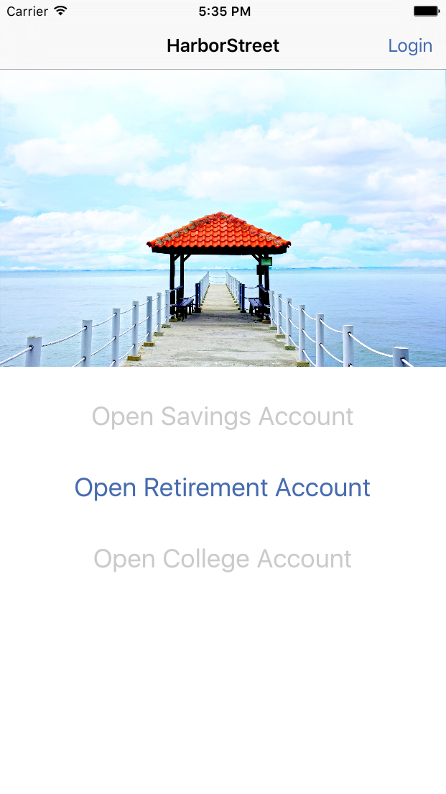
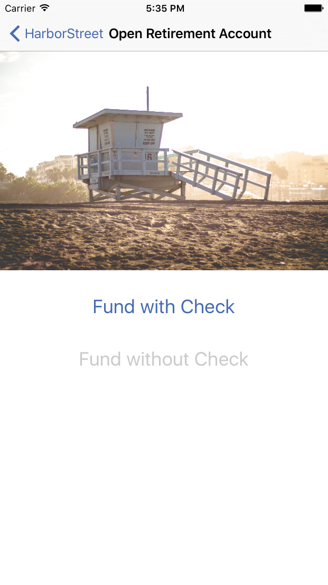
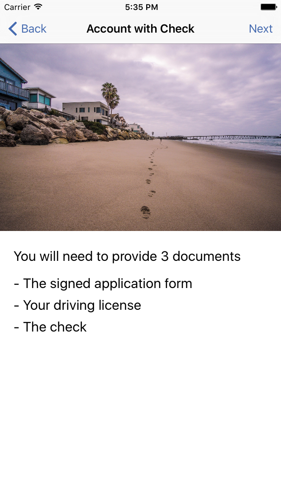
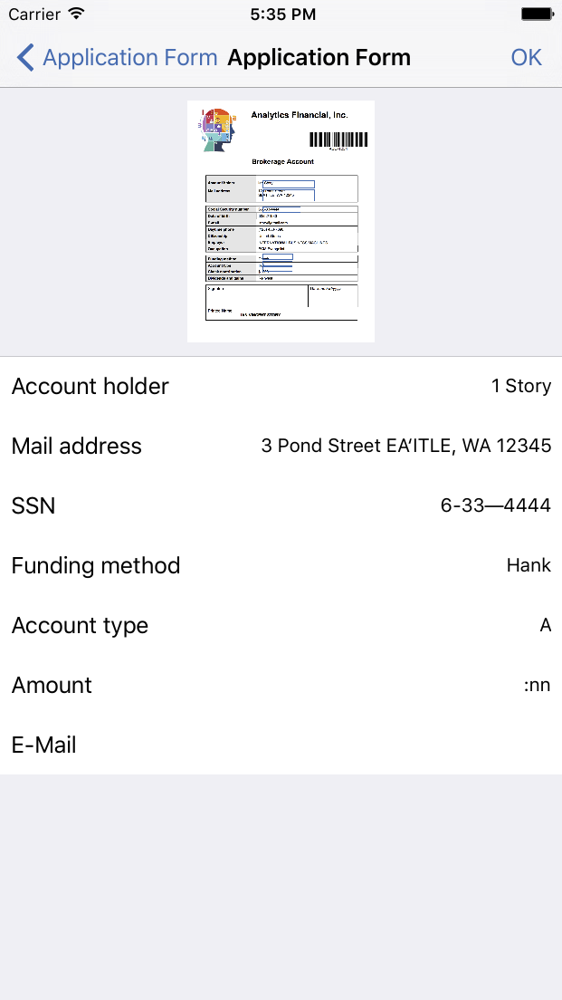
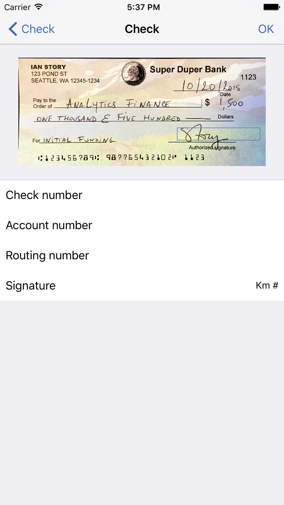
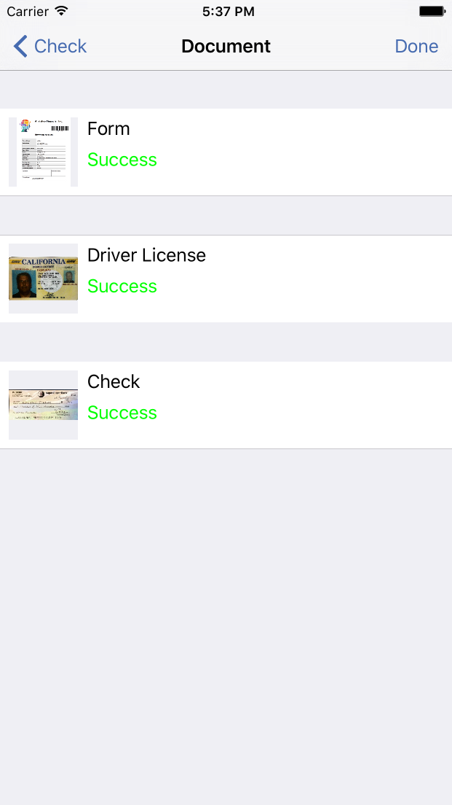
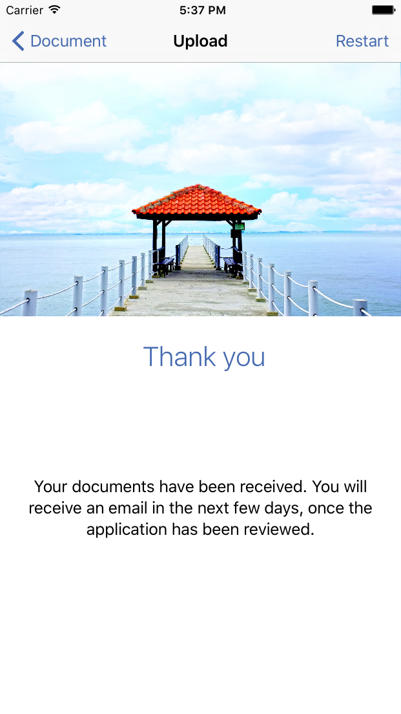

# Welcome

This document will provide you information about how to install and use the source code that demonstrate how to use the IBM Datacap Mobile SDK to capture and upload a document.

# Overview

The sample source code provided is intended to demonstrate the usage of the Datacap Mobile SDK to demonstrate how to create a flow to capture specific documents, perform a basic validation and upload it to a Datacap server. The app have a flow to guide the user on the actions and notify the success of the operation at the end of the upload.

### Screenshots

# Prerequisites

This document assumes the reader has a working knowledge of IBM Datacap, the Swift language and the iOS platform.

# Installation

Copy the archive on the computer where Xcode is installed.
From Xcode select "Open ..." > and select the HarborBoulevad.xcodeproj file.

# Setup

**The correct version of the .framework files need to be copied to the folder /Frameworks in the root of the sample app folder structure**

**Before you can run the sample app you need to configure the batch configurations in the app !**

Basically, you need to replace the values of the struct **SampleDatacapConfiguration** found in [**MainViewController.swift**](HarborBoulevard/MainViewController.swift).

This values need to reflect a valid batch configurated on a reachable IBM Datacap server instance.

**If you do not replace this values you will not be able to upload the image !**

## LICENSE

[Apache License Version 2.0](LICENSE)
